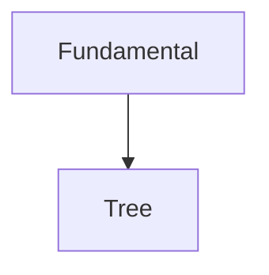

# MPI Algorithms Interest Group

# Introduction

Lecturer: Steve Yan [](https://www.aspires.cc)

Location: TBA

Time Schedule: TBA

Semester: 1

## Useful URLs

Typora: https://typora.io  

Google Colab: https://colab.research.google.com  

LeetCode: https://leetcode.com/problemset/all/  

POJ: http://poj.org/problemlist  

 OIWiki: https://oi-wiki.org 

## Covered Topic Abstract

Graph Theroy, Searching, Misc.

## How to use this repository?

Clone via HTTPS using following command or Click `Code` then `Download ZIP`.

```bash
git clone https://github.com/Ex10si0n/MPI-Interest-Group.git
```

You can open `README.md` (Markdown File: open via [Typora](https://typora.io) or notepad.exe) locally or on [this](https://github.com/Ex10si0n/MPI-Interest-Group) page.

## About this lecture

This lecture will specifically focus on the Algorithms implementation. My example code will be demostrated in Python, but you can adopt any kind of programming language if you prefer.

No slides are distributed (cuz. I do not regard slides as effecient format to display codes) but all of the codes and explanations are showed on this `README.md`.

Following topics will be covered in the Interest Group


