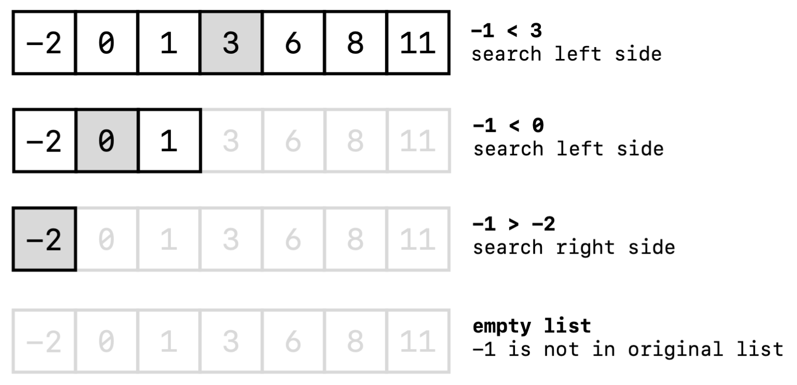

# Chapter 1. Fundamental Algorithms

## Binary Search

Binary Search is an efficient algorithm for finding an item from a **sorted** set of items. Here is an example for finding `-1` from the given list.



As the figure shows, adopting binary search can lower the time complexity from $O(N)$ to $O(\log N)$ [Note: When analysising Algorithms time and space complexity, $\log N$ stands for $log_2 N$]

The code pattern of binary search algorithms are easy to understand, we often use `l`, `r`, `mid` to point with the left and right pointer. `mid` is always calculated with the formular `l + r // 2`.

```python
# Assume that bigger answer is better
l = 0, r = N, mid

while l < r:
	mid = (l + r) // 2
    if can_solve(mid):
        l = mid
    else:
        r = mid

answer = mid
```

By extension, when solving a problem, we can also adopt binary search for searching the solution from a sorted list of possible solution. Here is an example, make your hands dirty.

### [Assignment I][P2678](https://www.luogu.com.cn/problem/P2678) Stones (NOIP15 Day2 Q1)

For a better understanding, you can read the problem in [CN Version](./assets/NOIP15_SD2T1.png).

The annual "stone jumping" competition is about to start again! The competition will be held in a straight river with huge rocks distributed in the river. The committee has selected two rocks as the starting and ending points of the competition. Between the start point and the end point, there are **N** pieces of rocks (the rocks that do not include the start point and the end point). During the competition, the players will start from the starting point and jump to the adjacent rocks at each step until they reach the finish line.

In order to increase the difficulty of the competition, the committee plans to remove some rocks to make the shortest jumping distance of the contestants as long as possible during the competition. Due to budget constraints, the committee can remove at most M rocks between the start and end points (the start and end rocks cannot be removed).

You should write a program to read **L, N, M** that represent the distance between starting point and ending point(**L**), the number of rocks between starting point and ending point(**N**), number of rocks the committe can remove at most(**M**). The data constraint is `L >= 1, N >= M >= 0`

For the following **N** lines, the i-th line has $D_i$, which represents the distance between the i-th rock and the starting point. The data constraint is `(i < j) Di < Dj, Di != Dj`

And your program should print an integer which is the maximum distance of minimum jumpping interval.

**Sample I/O**

Input Data:

```
25 5 2
2
11
14
17
21
```

Output Data:

```
4
```

Explanation:

After removing the rocks that distance from starting point are 2 and 14, the rest rocks are 11, 17, 21. The solution is optimal. You can try other methods to see the result.

```
[Start]--- 11 ---[Rock(11)]-- 6 --[Rock(17)]- 4 -[End(21)]
```

**Data Scaling**

| Portion | M                      | N                      | L                           |
| ------- | ---------------------- | ---------------------- | --------------------------- |
| 20%     | 0 ≤ M ≤ 10       | 0 ≤ M ≤ 10       | 1 ≤ L ≤ 1,000,000,000 |
| 30%     | 10 ≤ M ≤ 100     | 10 ≤ M ≤ 100     | 1 ≤ L ≤ 1,000,000,000 |
| 50%     | 100 ≤ M ≤ 50,000 | 100 ≤ M ≤ 50,000 | 1 ≤ L ≤ 1,000,000,000 |

#### Test your code

> **Mention**: You will see this **Test your code** Section when the problem is not available to test online, you may insert your codes on the template source code to implement algorithms in order to make the tester run dependablely.
>
> **How to test**: 
>
> 	1. set `RUN_TEST = True`
> 	2. copy the code file into directory `testing/`
> 	3. run the code with command `python <file_name>.py`
> 	4. Then the testing code will automatically start and result will be given

**P2678 Template** (Do not change lines indicated by `#`, your code can be inserted into the `main()` or `Solution class`)

```python
class Solution:                                          #
    '''
    Implement your algorithms here.
    '''
    pass

RUN_TEST = False
input_data = '''25 5 2
                2
                11
                14
                17
                21'''

def main(input_data):
    input_data_list = list(map(int, input_data.split())) #
    L = input_data_list[0]                               #
    N = input_data_list[1]                               #
    M = input_data_list[2]                               #
    D = input_data_list[3:]                              #
    sol = Solution()                                     #
    
    ans = None
    
    if not RUN_TEST: print(ans)                          #
    return ans                                           #

# Do not Change The following code
if __name__ == "__main__":
    from time import time
    from math import floor
    if not RUN_TEST: main(input_data)
    else:
        earning = 0
        testcases = 10
        for i in range(1, 1 + testcases):
            start = time()
            _in = open('./test_data/stone/stone%d.in' % i, 'r')
            key = open('./test_data/stone/stone%d.ans' % i, 'r')
            input_data = _in.read()
            ans = main(input_data)
            end = time()
            delta = floor((end - start) * 1000)
            if delta > 1000: print('Time Exceeded Limit.')
            elif ans - int(key.read()) == 0: 
                print('Test Point %d Accepted in %d ms.' % (i, delta))
                earning += 1
            else: print('Test Point %d Wrong Answer.' % i)
            _in.close(); key.close()
        print('Point (%d/%d)' % (earning, testcases))
```

#### Sol.

* **Brute Force**: We can select any groups of **M** stones to be removed. And record the maximum interval of the minimal jump.
* **Linear Search**: For the maximum interval of the minimal jump, actually we can adopt the **greedy methodology**. To try the answer(**ans**) from **L** to **1**. If two adjacent rocks has interval shorter than **ans**, then remove the next rock. If the attemption time less than **M**. It is just the optimal solution.
* **Binary Search**: It is obvious that the answer of the question is allocated between **1** and **L**. For all possibilities we can use binary search to reduce the complexity from $O(N)$ to $O(\log N)$. Try to write the code to adopt the **binary search methodology** similar to the [given code](https://github.com/Ex10si0n/Algorithms#binary-search).

**Core Code**

```python
class Solution:

    def can_solve(self, M, D, mid):
        remove = 0; _next = 0; now = 0; N = len(D)
        while _next < N - 1:
            _next += 1
            if D[_next] - D[now] < mid: remove += 1
            else: now = _next
        if remove > M: return False
        else: return True

    def binary_search(self, L, M, N, D):
        l = 0
        r = L
        ans = mid = 0
        while l <= r:
            mid = (l + r) // 2
            if self.can_solve(M, D, mid):
                ans = mid
                l = mid + 1
            else:
                r = mid - 1
        return ans
```
