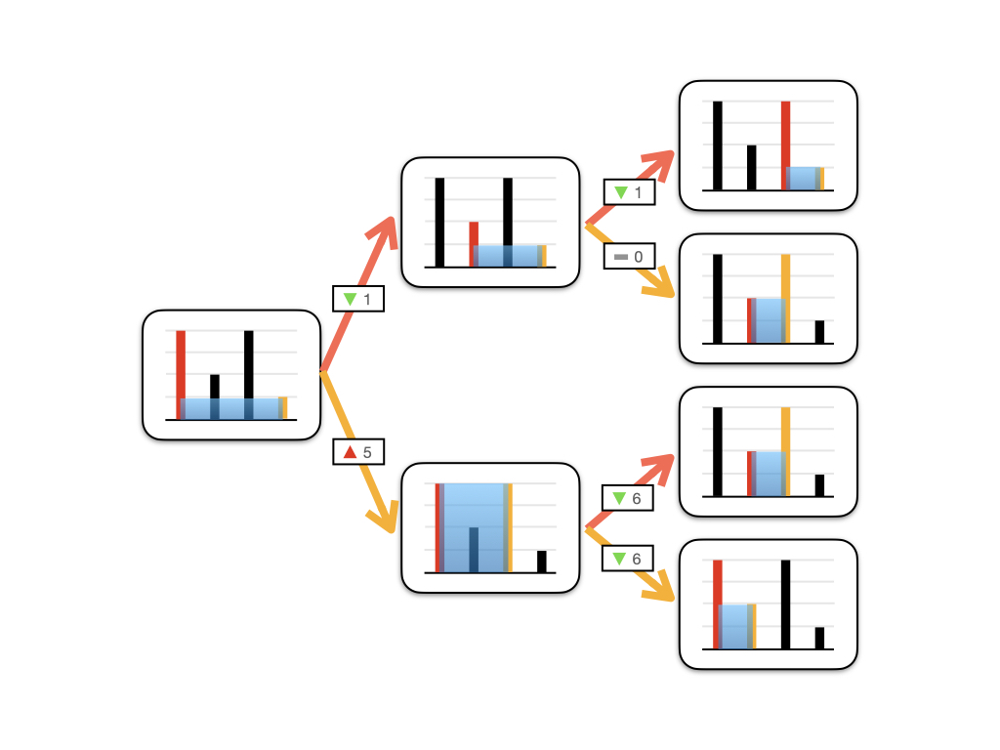

# Greedy

Greedy Algorithms can be adopted when a specific problem can be proofed that when locally optimal choice in each stages can produce a globally optimal choice. But in many problems, all stages is optimized does not means that it will be globally optimized.

### [LC11](https://leetcode.com/problems/container-with-most-water/) Container With Most Water

Given `n` non-negative integers `a1, a2, ..., an` , where each represents a point at coordinate `(i, ai)`. `n` vertical lines are drawn such that the two endpoints of the line `i` is at `(i, ai)`and `(i, 0)`. Find two lines, which, together with the x-axis forms a container, such that the container contains the most water.

**Notice** that you may not slant the container.

**Example 1:**


```
Input: height = [1,8,6,2,5,4,8,3,7]
Output: 49
Explanation: The above vertical lines are represented by array [1,8,6,2,5,4,8,3,7]. In this case, the max area of water (blue section) the container can contain is 49.
```

**Constraints:**

- `n == height.length`
- `2 <= n <= 105`
- `0 <= height[i] <= 104`

#### Sol.


* If in Brute Force (暴力枚举) way, we can encount `n * n` possibilities then calculate each area to get the max area.
* Greedy Approach can optimize the complexity from $O(N^2)$ to $O(N)$
  * Let `i` be the first line and `j` be the last line.
  * For each pair of lines selected, the covered area size is `A(i, j) = min(height_i, height_j) * (j - i)`.
  * If we move the longer line inner, `min(height_i', height_j') <= min(height_i, height_j)`
  * If we move the shorter line inner, `min(height_i', height_j') > or <= min(height_i, height_j)`
  * If the area will be larger, the contribution of updating lines will be positive.
  * Hence, we can only encount only `n - 1` times then we can get the largest area.
  * Ref. https://leetcode-cn.com/problems/container-with-most-water/solution/container-with-most-water-shuang-zhi-zhen-fa-yi-do/
  * Status Transferring Tree



```python
class Solution:
    def maxArea(self, height):
        i = 0
        j = len(height) - 1
        ans = 0
        while i < j:
            if height[i] < height[j]:
                ans = max(ans, height[i] * (j - i))
                i += 1
            else:
                ans = max(ans, height[j] * (j - i))
                j -= 1
        return ans
```

### [LC122](https://leetcode.com/problems/best-time-to-buy-and-sell-stock-ii/) Best Time to Buy and Sell Stock II (Exercise)

You are given an integer array `prices` where `prices[i]` is the price of a given stock on the `ith` day.

On each day, you may decide to buy and/or sell the stock. You can only hold **at most one** share of the stock at any time. However, you can buy it then immediately sell it on the **same day**.

Find and return *the **maximum** profit you can achieve*.

**Example 1:**

```
Input: prices = [7,1,5,3,6,4]
Output: 7
Explanation: Buy on day 2 (price = 1) and sell on day 3 (price = 5), profit = 5-1 = 4.
Then buy on day 4 (price = 3) and sell on day 5 (price = 6), profit = 6-3 = 3.
Total profit is 4 + 3 = 7.
```

**Example 2:**

```
Input: prices = [1,2,3,4,5]
Output: 4
Explanation: Buy on day 1 (price = 1) and sell on day 5 (price = 5), profit = 5-1 = 4.
Total profit is 4.
```

**Example 3:**

```
Input: prices = [7,6,4,3,1]
Output: 0
Explanation: There is no way to make a positive profit, so we never buy the stock to achieve the maximum profit of 0.
```

**Constraints:**

- `1 <= prices.length <= 3 * 104`
- `0 <= prices[i] <= 104`

#### Sol.


Consider two days

* if the stock price of the next day is higher than today, buy it and sell it at next day.
* in other circumstances, you can never earn more money.

```python
class Solution:
    def maxProfit(self, prices):
        max = 0
        for i in range(1, len(prices)):
            if prices[i] > prices[i - 1]:
                max += prices[i] - prices[i - 1]
        return max
```
