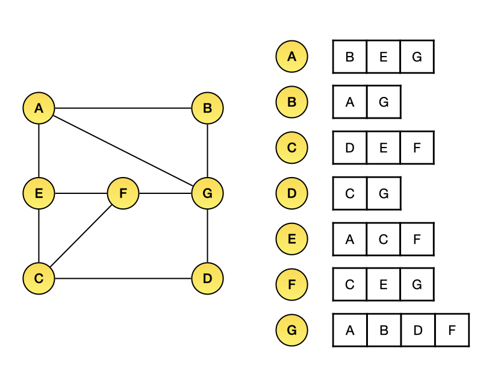

# Generic Graph

In this section, I will only introduce the data structure of generic graph and the implementation. The more complex version of graph is in the following chapter.

#### Adjacency Matrix

Let's back to this straightforward staff: The **adjacency matrix** to describing or saving a graph in the memory. If node A and node B is interconnected, then `adj[A][B] = adj[B][A] = edge_value`(Where `edge_value (边权值)` is the **cost** of travelling through each edges). If it is a directed graph, `A -> B` means there is a path from A to B but not from B to A, then `adj[A][B] = edge_value`. The space complexity is $O(N^2)$. That means if the graph has 1,000,000 nodes, an 1,000,000 x 1,000,000 matrix will take in use. Although the size is horrible, it is the most easy understanding way of describing a graph, here is the example and code implementation.


**Code to initialize**

```python
nodes = ['A', 'B', 'C', 'D', 'E', 'F']
n = len(nodes)

# pure python
adj = []
for i in range(n):
    adj.append([0] * n)
               
# equivalent form by numpy
import numpy
adj = numpy.zeros([n, n])
```

**Exercise**: Build an adjacency matrix of non-directed graph in last figure then print the matrix and list all the edge in `A --- B` form.

```
# Insert your code below
```

**One of the solutions**

```python
edges = ['A B', 'B E', 'B C', 'E C', 'E D', 'C D', 'E F']
_map = {'A': 0, 'B': 1, 'C': 2, 'D': 3, 'E': 4, 'F': 5,\
         5: 'F', 4: 'E', 3: 'D', 2: 'C', 1: 'B', 0: 'A'}

adj = []
n = len(edges)


for i in range(n):
    adj.append([0] * n)

for e in edges:
    from_node, to_node = e.split(' ')
    adj[_map[from_node]][_map[to_node]] = adj[_map[to_node]][_map[from_node]] = 1

for i in range(n):
    for j in range(i, n):
        if adj[i][j] == 1:
            print(_map[i], '---', _map[j])
```

#### Adjacency List

An array of lists is used. The size of the array is equal to the number of vertices. Let the array be an `G[]`. An entry `G[i]` represents the list of vertices adjacent to the i-th vertex. This representation can also be used to represent a weighted graph. The weights of edges can be represented as lists of pairs. Following is the adjacency list representation. **It is not hard to change the adjacency matrix to list form if you really understand how it works.**



**Code to implement** [\[src code\]](../codes/data-structure/adjacency\_list.py)

```python
G = {}
for i in range(10):    # The above graph has 10 edges
    from_node, to_node = input().split(' ')
    if from_node in G.keys(): G[from_node].append(to_node)
    else: G[from_node] = [to_node]
    if to_node in G.keys(): G[to_node].append(from_node)
    else: G[to_node] = [from_node]
        
print(G)
```

```
G = {'A': ['B', 'E', 'G'],
     'B': ['A', 'G'],
     'C': ['D', 'E', 'F'],
     'D': ['C', 'G'],
     'E': ['A', 'C', 'F'],
     'F': ['C', 'E', 'G'],
     'G': ['A', 'B', 'D', 'F']}
```

Up till now, you have read all of the contents of Chapter 1. I strongly advice you writing the code from the scratch to implement the basic data structure. In the following chapter, it's time to learn some tricky stuffs.
