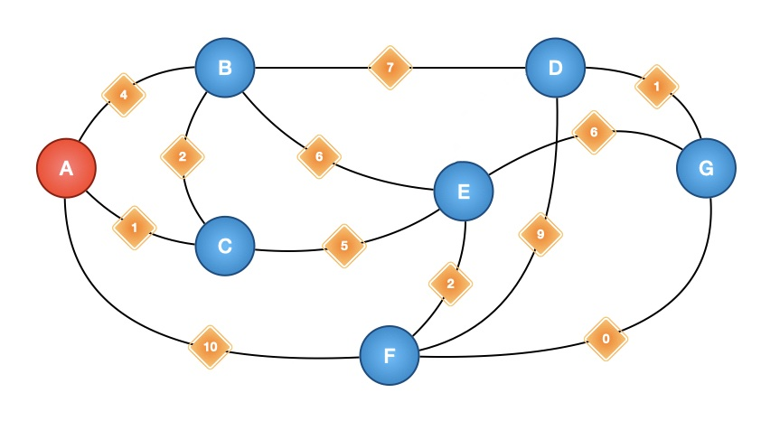

# Shortest Path I

Here is the map of Ex10si0n island. He designed the arrangement of each town (namely A B C D E F G -town) with roads. When the tourist go through a certain path, he or she will pay for a number of coins. The cost of each road is the number inside each diamonds.

You are paying a visit to Ex10si0n island. Can you find the minimum cost for travelling between arbitary two towns?

You may notice that A town is marked in red. The red color have no meanings in current problem.



**Graph data**

```python
_map = {}
for i in range(7): _map[i] = chr(i+65); _map[chr(i+65)] = i
towns = [chr(i) for i in range(65, 65+7)]
edges = ['A B 4', 'A C 1', 'B C 2', 'B D 7', 'B E 6', 'C E 5',\
         'D G 1', 'E G 6', 'E F 2', 'A F 10', 'F D 9', 'F G 0']
```

### Floyed Warshall

The explanation of Floyed Warshall Algorithm is a little bit complicated in Wiki. From my perspective and understanding, this algorithm is quite easy to understand, the core code is relaxation (松弛操作) while it is the core code of all kinds of Algorithms applied to Shortest Path problems. For the relaxation, the pseudo code below shows how to implement it.

NB: `dis[a][b]` means the minimum distance between node **A** and node **B**, the `dis[][]` array is initialize by infinity number.

```python
# Relaxation
for (from, to, bridge) in adj:
dis[from][to] = min(
	dis[from][to],    # (O)rigin distance
	adj[from][to],    # (D)irect path
	dis[from][bridge] + dis[bridge][to],    # (B)ridge node path
)
```

That is, for each three distinct node, there are three paths need to be compaired, namely `O`, `D`, and `B`. For each pair of path (or abstract path) to iterate, actually we just need to consider the following question.


> We go to **B** from **A**. Is the path `A --> B` shorter or we finding a bridge node **C** and the path `A --> C --> B` shorter?
>
> To make it abstract, for any node **F**, **T**: if there is a bridge node **V** can make the distance shorter, adopt it.
>
> As for `dis[F][T]` records the minimum distance rather than a specific path, that means, we can go to **T** from **F** with minimum distance to walk regardless of which path.
>
> As a result, `dis[from][bridge] + dis[bridge][to]` may not represent the relation of three node like `E -> (F) -> D`. But it can represent `E -> (F -> G) -> D` due to the specific path is omited, we care about the distance instead.

Full code implementation

```python
def add_edge(adj, edge):
    f, r, v = edge.split(' ')
    f = _map[f]; r = _map[r]; v = int(v)
    adj[f][r] = adj[r][f] = v

def floyed(adj):
    n = len(adj)
    dis = [[float('inf') for i in range(n)] for j in range(n)]
    for i in range(n): dis[i][i] = 0
    for bridge_node in range(n):
        for from_node in range(n):
            for to_node in range(n):
                dis[from_node][to_node] = min(
                    dis[from_node][to_node], 
                    adj[from_node][to_node], 
                    dis[from_node][bridge_node] + dis[bridge_node][to_node]
                )
    for i in dis:
        print(i)

if __name__ == '__main__':
    towns = [chr(i) for i in range(65, 65+7)]; _map = {}
    adj = [[float('inf') for i in range(len(towns))] for j in range(len(towns))]
    edges = ['A B 4', 'A C 1', 'B C 2', 'B D 7', 'B E 6', 'C E 5',\
         'D G 1', 'E G 6', 'E F 2', 'A F 10', 'F D 9', 'F G 0']
    for i in range(7): _map[i] = chr(i+65); _map[chr(i+65)] = i
    for edge in edges: add_edge(adj, edge)
    floyed(adj)
```
