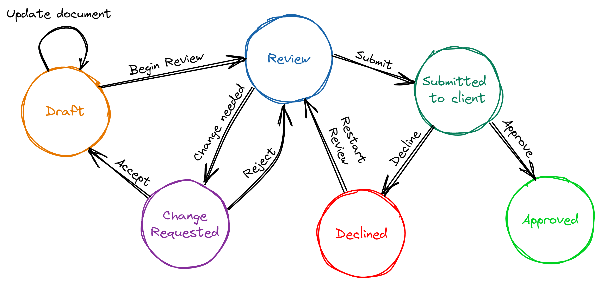
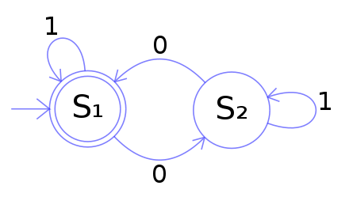

# Aho–Corasick Automaton

Aho-Corasick Automaton is a famous Algorithm that is invented by [Alfred V. Aho](https://en.wikipedia.org/wiki/Alfred_V._Aho) and Margaret J. Corasick in 1975. This Algorithm is for matching a series of string(i.e. `["app", "apple", "sem", ...]`) in a document at the same time. It is as famous as the KMP Algorithm and the philosophy of these two Algorithms are similar. Aho-Corasick Automaton is a exquisite Algorithm and worth learning. Here we go!

## The mathematical stuff

It is essential to have a knowledge of some mathematical stuff before introducing the Algorithm. And the math here is really straight-forward.

**Finite-state machine(FSM)** is a mathematical model of computation. It can change from one state to another in response to some inputs. Here is an practical example for a quick glance at the FSM.



From the example you can see that, the term FSM is just a abstract for a bunch of process of which the statue can change during the inputs(like "Begin Review", "Submit", ...). For an abstract version, take a look at the following graph.



It is worth to mention that `S1` here, which has double circle, is the starting or beginning status. And we can see that, within a bunch of inputs of 1 and 0, we can stand of either `S1` or `S2` and it depends on what sequence of inputs we have.

For this S1-S2 automaton, assume we have input is `[1, 0, 1, 1, 0]`. Then the state change is `S1 → S2 → S2 → S2 → S1`.

Since now, the mathematical part is finished. Now the exciting part is beginning.

## Trie

A **trie**, also called **dictonary tree** or **prefix tree**, is a tree-like data structure for finding a word(determine if the word has been added to the set). Here is an example:


Here is features of a Trie.

* The root node of Trie is 0
* Each character is marked on the edge
* Leave nodes(4, 6, 9, 10) must mean the ending of a word
* Other nodes(1, 7, 10, 2, 5, 8, 3) may mean the ending of a word

**Which means:**

* If this trie is constructed with the dictionary `[hers, his, she, i]`, then nodes 4, 6, 9, 10 are ending of a word.

* If this trie is constructed with the dictionary `[he, her, hers, his, hi, she, i]`, then nodes 2, 3, 4, 5, 6, 9, 10 are ending of a word.

Besides, for each non-leaf nodes(including root), each edge that links to the child node is unique. In another word, for node 0, it has three edges namely `h, s, i`. It is illegal when having edges `h, h, s, i`, that is beacuse it contains two `h` edges.

## Aho–Corasick Automaton: Fail pointer

Aho–Corasick Automaton can be achieved due to the Trie. And this Algorithm upgrade the Trie by adding **fail pointers**. Fail pointers is like a Portal in certain nodes on the Trie tree. When you step on the "Portal node", it could send you to another node.


Here is the fail pointers(in yellow arrows) for the previous Trie. The fail pointers is constructed by a tiny Algorithm which I will introduce later. Now we shall play with the upgraded trie with fail pointers. We can see that:

* Each node has a fail pointer
* The fail pointer of a node is either point to **root node** or point to **another node**

Now is the Algorithm for the construction of fail pointer:

Consider a trie with current node `u`, the parent node of `u` is `p`, `p` go through the edge of character `c`(s, h, e, ... in this example) to `u`. That is represented by `trie[p, c] = u`. Assume that all the fail pointers whose depth is smaller that depth of `u` is determined:

1. If `trie[fail[p], c]` exists: let `fail[u]` be `trie[fail[p], c]`. Which means add character `c` after `p` and `fail[p]` and correspoding to `u` and `fail[u]`
2. If `trie[fail[p], c]` not exists: find `trie[fail[fail[p]], c]` recursively and go back to step 1. Untill fail pointer points to the root node.
3. If fail pointer points to root node: record `fail[u] = root`


The code of constructing fail pointer is shown in Python:

```python
def build():
    for i in range(0, 26):
        if tr[0][i] == 1:
            q.append(tr[0][i])
    while len(q) > 0:
        u = q[0]
        q.pop()
        for i in range(0, 26):
            if tr[u][i] == 1:
                fail[tr[u][i]] = tr[fail[u]][i]
                q.append(tr[u][i])
            else:
                tr[u][i] = tr[fail[u]][i]
```

## Aho–Corasick Automaton: Matching

Here as the currently matched node on the dictionary tree, `res` is the returned answer. Loop through the matching string, keeping track of the current character in the dictionary tree. Use the fail pointer to find all matching patterns and add them to the answer. Then clear. As we have analyzed above, the structure of the dictionary tree is actually a trans function, and after constructing this function, in the process of matching strings, we will discard some prefixes to achieve the minimum matching. The fail pointer points to more matching states. 


If we match a document `ushersheishis`, The status trans will be:

```
(0) - s → (7) - h → (8) - e → (9: she) → (2: he) - r → 
(3: her) -s→ (4: hers) → (7) -h→ (8) -e→ (9: she) → 
(2: no edge i, back to root) → (0) -i→ (10: i) → 
(0) -s→ (7) -h→ (8) → (1) -i→ (5: hi) -s→ (s: his) → EOF
```

And we find words with frequency:

```
she: 2
he: 1
her: 1
hers: 1
i: 1
hi: 1
his: 1
```

## Time complexity

Preprocessing stage Θ(*n*): 

* Θ(*n*) work to build the trie,

* Θ(*n*) work to fill in suffix links, 

* Θ(*n*) work to fill in output links.

Final Totals ⟨O(n), O(m + z)⟩:

## Reference

https://web.stanford.edu/class/archive/cs/cs166/cs166.1166/lectures/02/Small02.pdf

https://oi-wiki.org/string/ac-automaton/