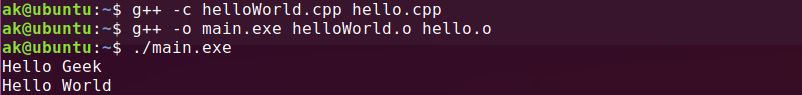

# GCC Compiler

**g++** command is a GNU c++ compiler invocation command, which is used for preprocessing, compilation, assembly and linking of source code to generate an executable file. The different “options” of g++ command allow us to stop this process at the intermediate stage. \


* **Check g++ compiler version information:**\


```
g++ --version
```


* **Compile a CPP file to generate executable target file:** _g++ file\_name_ command is used to compile and create an executable file _a.out_ (default target name).\
  **Example:** Given a simple program to print “Hello Geek” on standard output with file name _hello.cpp_\

* CPP

### CPP

```cpp
#include <iostream>
int main()
{
    std::cout << "Hello Geek\n"``;
    return 0;
}
```

```
g++ hello.cpp
```


This compiles and links _hello.cpp_ to produce a default target executable file _a.out_ in present working directory. To run this program, type **./a.out** where **./** represents present working directory and **a.out** is the executable target file.\


```
./a.out
```


* **g++ -S file\_name** is used to only compile the **file\_name** and **not** assembling or linking. It will generate a **file\_name.s** assembly source file.\
  **Example:**\


```
g++ -S hello.cpp
```

* **g++ -c file\_name** is used to only compile and assemble the **file\_name** and **not** link the object code to produce executable file. It will generate a **file\_name.o** object code file in present working directory.\
  **Example:**\


```
g++ -c hello.cpp
```

* **g++ -o target\_name file\_name:** Compiles and links **file\_name** and generates executable target file with **target\_name** (or a.out by default).\
  **Example:**\


```
g++ -o main.exe hello.cpp
```


* **Compile and link multiple files:** When the _-c_ flag is used, it invokes the compiler stage which translates source code to object code. When the -o flag is used it links object code to create the executable file from **file\_name.o** to **a.out(default)**, multiples files may be passed together as arguments.\


**Example:**

```cpp
// hello.cpp
#include "helloWorld.h"
#include <iostream>
int main()
{
    std::cout << "Hello Geek\n"``;
    helloWorld();
    return 0;
}
```

```cpp
// helloWorld.cpp
#include <iostream>
void helloWorld()
{
    std::cout << "Hello World\n"``;
}
```

```
g++ -c helloWorld.cpp hello.cpp
```

* It compiles and creates object code for the files helloWorld.cpp and hello.cpp to helloWorld.o and hello.o respectively.\


```
g++ -o main.exe helloWorld.o hello.o
```

* It links the object codes helloWorld.o and hello.o to create an executable file main.exe\


```
./main.exe
```

* It runs the executable file `main.exe`


